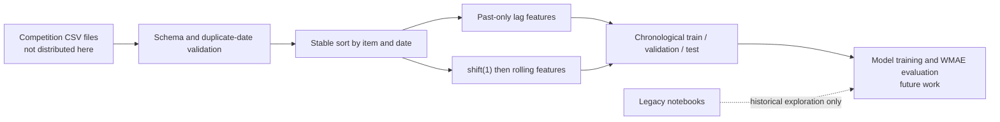

# Rohlik Sales Forecasting: Leakage-Safe Reference Layer

[](https://github.com/emrekaany/Kaggle_Rohlik_Sales_Forecasting_Challenge/actions/workflows/quality.yml)
[](LICENSE)

A portfolio case study for the [Rohlik Sales Forecasting Challenge](https://www.kaggle.com/competitions/rohlik-sales-forecasting-challenge-v2/overview), focused on a trustworthy time-series foundation: chronological splits, past-only lag features, and shifted rolling statistics.

The original competition notebooks remain in the repository as **legacy exploration**. They are not the recommended reproducible path and their historical model output is not presented as verified performance.

## Problem

The challenge asks participants to forecast 14 days of item-level sales across multiple warehouses. A useful forecast can support inventory, logistics, availability, and waste reduction. The central engineering risk is temporal leakage: a feature for day `t` must not use the target from day `t` or any future date.

This repository therefore separates two surfaces:

1. a small, testable reference layer that encodes leakage-safe feature and split contracts; and
2. legacy notebooks that record the earlier Kaggle exploration but require methodological review before reuse.

## Architecture



The current source layer does not train CatBoost or claim a leaderboard result. Its scope is the correctness boundary that a later model pipeline can build on. See [the architecture contract](docs/architecture.md).

## Quickstart

### Run the verified synthetic path

```bash
git clone https://github.com/emrekaany/Kaggle_Rohlik_Sales_Forecasting_Challenge.git
cd Kaggle_Rohlik_Sales_Forecasting_Challenge
python -m venv .venv
source .venv/bin/activate
python -m pip install --upgrade pip
python -m pip install -e .
python -m unittest discover -s tests -v
python scripts/validate_notebooks.py
python -m rohlik_forecasting.demo
```

The demo creates two synthetic item histories, builds lag/rolling features, and applies fixed time boundaries. It downloads nothing and does not require Kaggle credentials.

### Attach the competition data separately

After accepting the competition rules in your own Kaggle account:

```bash
mkdir -p data/raw
kaggle competitions download -c rohlik-sales-forecasting-challenge-v2 -p data/raw
```

Competition files are intentionally ignored by Git. Review [DATA_PROVENANCE.md](DATA_PROVENANCE.md) before using or publishing any artifact. The reusable source API expects `unique_id`, `date`, and `sales` by default:

```python
from rohlik_forecasting import add_leakage_safe_features, chronological_split

features = add_leakage_safe_features(
    sales_train,
    group_columns=("unique_id",),
    date_column="date",
    target_column="sales",
    lags=(1, 7, 14),
    rolling_windows=(7, 28),
)

splits = chronological_split(
    features,
    validation_start="2024-05-01",
    test_start="2024-05-15",
    date_column="date",
)
```

Choose boundaries from the actual competition timeline; the dates above illustrate the API and are not recommended competition settings.

## Measured evidence

Repository-level checks cover these contracts with synthetic data:

- a rolling feature for day `t` excludes `sales[t]`;
- changing a current target cannot change that row’s past-only features;
- lag values never cross item boundaries;
- duplicate item/date rows are rejected;
- train, validation, and test partitions are non-empty and strictly chronological.

Local verification of this revision passed all 6 contract tests with Python 3.12 and pandas 2.2.3. The offline demo produced 12 synthetic feature rows and a chronological `8 / 2 / 2` train-validation-test split. These are software-correctness measurements, not forecasting-performance results.

The notebook integrity audit records the committed evidence honestly:

| Legacy notebook | Code cells | Executed cells | Stored outputs | Status |
|---|---:|---:|---:|---|
| `rohlik-datapreparation.ipynb` | 32 | 0 | 0 | Unexecuted exploration; not the reference preprocessing path |
| `rohlik-hyperparameter-optimization.ipynb` | 7 | 2 | 2 | Partial historical execution only |
| `rohlik-catboost-final.ipynb` | 14 | 0 | 0 | Unexecuted snapshot; no verified final result |

No competition score, WMAE, runtime, or production-readiness claim is made because the competition data and end-to-end training pipeline were not rerun in this repository revision.

## Legacy notebook warning

The older notebooks combine train and test during preparation and include target-derived operations whose temporal boundaries are not reliably enforced. Rolling target features are not consistently shifted before aggregation. Treat them as historical exploration only. Use `src/rohlik_forecasting/` as the correctness reference and independently review any feature migrated from a notebook.

## Limitations

- Competition data, model weights, fitted artifacts, and submissions are not distributed.
- The source layer stops before model training, tuning, weighted evaluation, and submission generation.
- Multi-step forecasting may require recursive prediction or a direct-horizon design; the static feature builder does not invent unavailable future targets.
- Calendar, pricing, availability, inventory, and holiday joins still need explicit as-of-time availability checks.
- The synthetic tests prove local contracts, not leaderboard quality or business impact.
- Historical notebooks may depend on a Kaggle GPU image and packages not declared by the reference package.

## CTA

If you are evaluating time-aware feature engineering, data-quality contracts, or a production forecasting design, connect with [Emre Kaan Yılmaz on LinkedIn](https://www.linkedin.com/in/emrekaany/) or open a focused issue. Contributions should preserve the past-only feature invariant and include a synthetic regression test.

## License

Repository-authored source code and documentation are available under the [MIT License](LICENSE). Rohlik competition data, competition text/assets, and third-party dependencies remain subject to their original terms.
